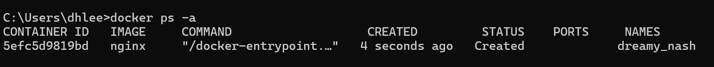
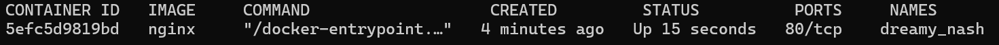
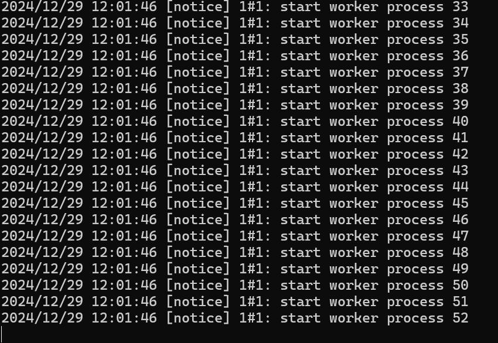
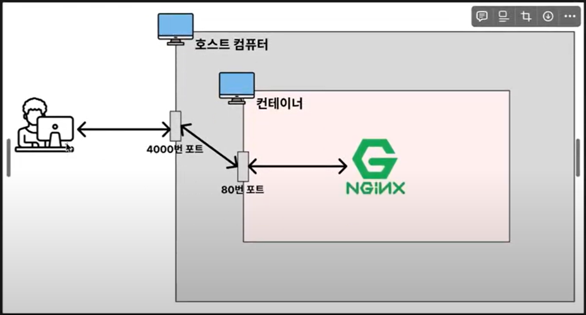

[유튜브](https://www.youtube.com/watch?v=Rw1gRR7lZwQ&list=PLtUgHNmvcs6rS5aNCRIZtVcyk3gRX2iOd&index=4)

# 전체 흐름 느껴보기
```docker
docker pull nginx   #nginx의 이미지를 다운받는 명령어
```
```docker
docker image ls     # 다운받은 image 목록을 볼 수 있다.
```
```docker
docker run --name webserver -d -p 80:80 nginx #컨테이너 실행
```

chrome으로 가서
>localhost:80

을 입력하면 nginx가 설치되고 실행되었다는 것을 알 수 있다.

```docker
docker ps       #실행되고 있는 컨테이너의 목록을 나타낸다.
```
```docker 
docker stop webserver       #실행시킨 webserver 컨테이너를 정지시킨다.
```

chrome에서 localhost:80을 새로고침 하면 실행이 안된다.

---

# 이미지 다운로드

```docker
docker pull nginx   #nginx의 이미지를 다운받는 명령어
```

```docker
docker image ls     # 다운받은 image 목록을 볼 수 있다.
```

이미지를 어디서 다운 받았는가?
- dockerhub로부터 다운을 받음.
- dockerhub란?
    - 사람들이 올려놓은 이미지들이 저장되어 있고 그 이미지들을 pull을 통해 다운받아서 사용하도록 만든 저장소임.
- dockerhub에 올라온 이미지마다 버전이 있다. dockerhub에서 tags를 누르면 다양한 tag명이 나와있는데 이 tag명이 버전을 의미함. 특정 버전을 나타내는 이름을 tag명이라 하고 특정 tag명을 가진 image를 다운 받고 싶다면 https://hub.docker.com/_/nginx/tags 에서 원하는 tag를 찾은 후
```docker
docker pull nginx:stable-alpine3.19-perl # ":" 뒤에 tag명을 붙여서 쓰면 된다.
```

위에서 본
```docker
docker pull nginx  
```
의 경우 뒤에 :latest가 생략되어 있다.

---

# 이미지 조회
```docker
docker image ls     #다운받은 이미지 조회 가능. (ls는 list를 의미)
```

- tag는 각 이미지의 version을 뜻한다.
- image id는 각 이미지마다 고유의 id값이 있는데 그것을 의미함.
- created는 이미지가 생성된 날짜를 의미(이미지를 다운받은 날짜가 아니다!)

이미지를 삭제하려면
```docker
docker image rm [image id]
```
를 하면된다.

예시)
nginx:stable-alpine3.19-perl의 image id가 456c0c9bd0d4라면
```docker
docker image rm 456c0c9bd0d4
```
를 하면 됨.

하지만~~~ 그냥 아래와 같이 image id의 일부만 쳐도 가능하다.
```docker
docker image rm 456c
```

<br>
중단시키든, 사용되고 있든 존재하고 있는 컨테이너에서 이미지가 사용되고 있으면 이미지를 지우지 못한다. 즉 컨테이너에서 사용하고 있지 않은 이미지만 삭제가 가능하다.

만일 이미 중단된 컨테이너에 있는 이미지를 강제로 삭제하고 싶다면?

* -f를 이용해서 삭제.
```docker
docker rm -f 742e9       #42e9는 nginx의 image id이다.
```

* -f 는 중단된 컨테이너에 대해 이미지를 삭제할 수 있지만, 실행중인 컨테이너의 이미지는 삭제할 수 없다.

* 그러고 docker image ls를 이용해서 확인을 하면 이미지가 잘 삭제된 것을 확인할 수 있다.


```docker
docker image rm $(docker images -q)     #컨테이너에서 사용하고 있지 않은 전체 이미지를 삭제하는 명령어
```
***
**chatgpt 설명**

docker image rm $(docker images -q) 명령어는 Docker에서 사용되는 두 가지 명령어를 결합한 형태입니다. 각 부분을 자세히 살펴보겠습니다.

### 1. **docker images -q:**

docker images는 현재 로컬 Docker 환경에 있는 모든 이미지를 나열하는 명령어입니다.
-q 옵션을 사용하면 이미지의 상세 정보 대신 이미지 ID만 출력됩니다. 즉, 모든 이미지의 ID를 리스트 형식으로 반환합니다.

### 2. **docker image rm:**

docker image rm 명령어는 지정된 이미지를 삭제하는 명령어입니다.
이 명령어는 이미지 ID를 인자로 받아, 해당 이미지를 삭제합니다.

### 3. **$(...):**

$(...)는 명령어 치환 (command substitution) 방식으로, 괄호 안에 있는 명령어를 실행하고 그 결과를 외부 명령어로 전달하는 역할을 합니다.
즉, docker images -q 명령어가 반환한 이미지 ID 리스트를 docker image rm 명령어에 인자로 넘깁니다.
전체적으로 보면:
docker image rm $(docker images -q)는 로컬 Docker 이미지들을 모두 삭제하는 명령어입니다.

### 전체적으로 보면
docker images -q가 모든 이미지의 ID를 반환하고,
docker image rm이 그 ID들에 해당하는 이미지를 하나씩 삭제하는 방식입니다.
이 명령어는 모든 Docker 이미지를 한 번에 삭제하고 싶을 때 사용합니다.

***
만일) 중단된 컨테이너에서 사용하는 이미지를 모두 삭제하고 싶으면 
```docker
docker image rm -f $(docker images -q)
```
를 하면 된다.

---

## 컨테이너(Container) 생성 / 실행 - 1
```docker
docker create nginx     #Docker에서 nginx 이미지를 사용하여 컨테이너를 생성
                        #이미지가 존재하지 않는다면 자동으로 다운을 해준다.
                        #즉 docker pull로 이미지를 다운받지 않아도 된다.
                        #컨테이너 이름은 docker에서 자동으로 생성해준다.
```
그러고
```docker
docker ps -a
```
를 하면 다음과 같이 나온다.



얘는 미니 컴퓨터라고 할 수 있는 컨테이너를 생성을 했는데 아직 실행은 시키지 않은 상태다.(status에 created라고 나와있다.)

이 컴퓨터를 키는 명령어는
```docker
docker start [container id]

#예시로
docker start 5efc5d9819bd           #container id 를 일부만 입력해도 된다.
```
이후에 
```docker
docker ps -a
```
를 이용해서 컨테이너가 잘 실행되는 지 확인할 수 있다.

여기서 확인할 점은 status에 up 즉 실행되고 있다는 것을 확인할 수 있다.

결론: 이미지를 다운 -> 컨테이너를 생성 -> 컨테이너를 실행 

```docker
docker stop 5efc5           #컨테이너 중단

docker rm 5efc5             #컨테이너 삭제
```

---

근데 현업에서는 docker create와 start를 따로 실행시키는 경우는 많지 않다. 

이걸 합쳐놓은 명령어가
```docker
docker run
```
이다. 이 명령어는 docker create와 docker start를 한번에 해준다.

예시)
```docker
docker run nginx            #이미지가 존재하지 않아도 자동으로 다운받고 실행해줌.
```

위에서 docker create와 start를 설명한 이유는 컨테이너가 어떤 단계를 거쳐서 실행되는 지 확인하기 위해서다.



위의 사진에서 관찰할 수 있는 점은 docker run을 한 후 명령어를 쳤을 때 명령어가 실행이 되지 않는다. 이는 docker run이 포그라운드에서 실행을 하기 때문이다. 

포그라운드란, 현재 실행 중인 프로그램이나 프로세스가 터미널이나 쉘에서 직접 제어되고 있는 상태를 의미한다. 요약하자면 내가 실행시킨 프로그램의 내용이 화면에서 실행되고 출력되는 상태를 말한다. 다른 프로그램을 조작할 수 없다.

백그라운드란, 프로그램이 실행되지만, 터미널의 제어를 받지 않는 상태입니다. 즉, 내가 실행시킨 프로그램이 컴퓨터 내부적으로 실행되는 상태를 말한다. 로그가 어떻게 찍히는 지를 실시간으로 확인할 수 없다. 

만일, 백그라운드에서 run을 시키고 싶다면?
```docker
docker run -d nginx
```
로 -d 옵션을 쓰면 된다.

그런 후 
```docker 
docker ps
```
를 통해 확인한다.

컨테이너에 이름을 붙이고 싶다면?
```docker
docker run -d --name my_web_server nginx    #my_web_server라 이름을 붙였다.
```

---

컨테이너는 기본적으로 호스트 시스템과 네트워크적으로 격리되어 있다.<br>
그래서 위에서 docker run -d nginx를 하고 나서(컨테이너 내부에서만 80번 포트를 기본값으로 실행) localhost:80을 했을 때 연결이 안된다.<br>

컨테이너 내에서 실행되는 웹 서버나 데이터베이스 등 서비스에 외부에서 직접 접근하려면 해당 서비스가 사용하는 포트를 외부와 연결해야 한다.<br>
포트 연결을 통해 호스트 시스템의 포트를 컨테이너의 포트와 연결하여, 외부에서 접근할 수 있도록 한다.

```docker
docker run -d -p [호스트 포트]:[컨테이너 포트] 이미지명[:태그명]

#예시
docker run -d -p 4000:80 nginx
```


* 사용자가 외부에서 4000번 포트로 요청을 보내서 컨테이너의 80번 포트와 연결시키겠다는 의미.
* 연결이 되었는 지 확인해 보려면 chrome에서 localhost:4000을 하면 됨.
* localhost:80은 연결이 안됨.

만일
```docker
docker run -d -p 80:80 nginx
```
를 하면 localhost:80을 했을 때 들어가진다.